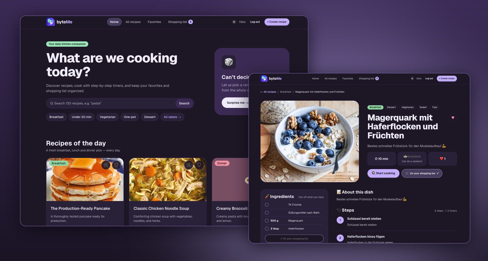
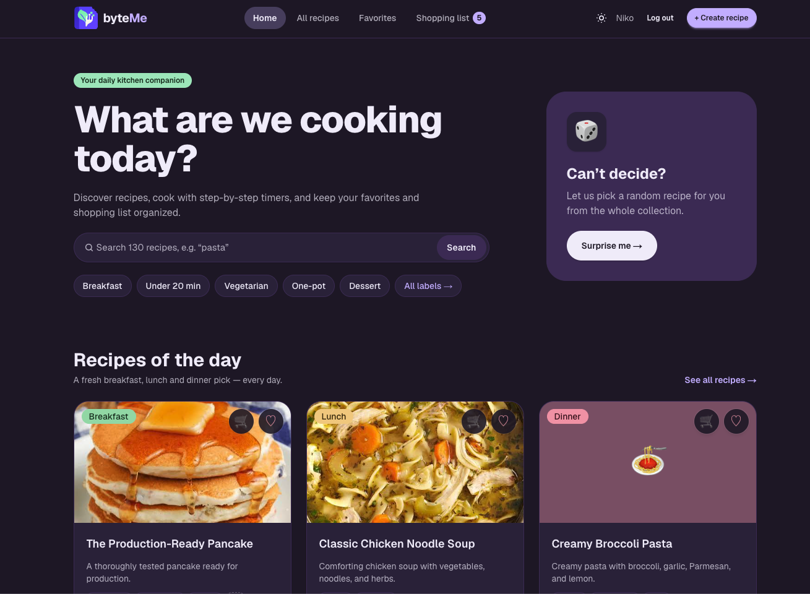
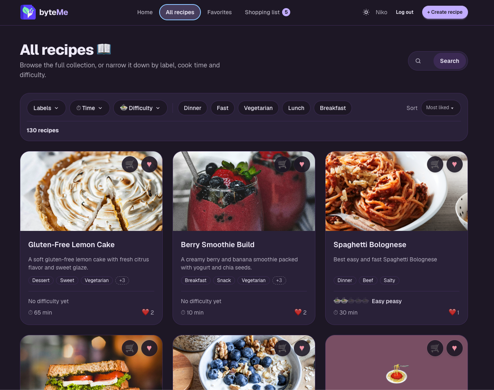
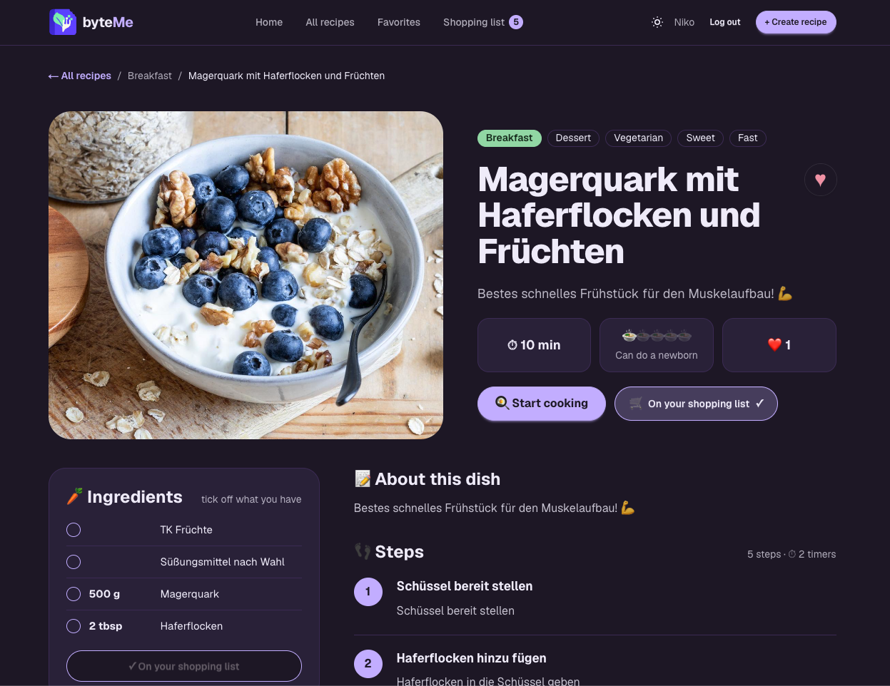
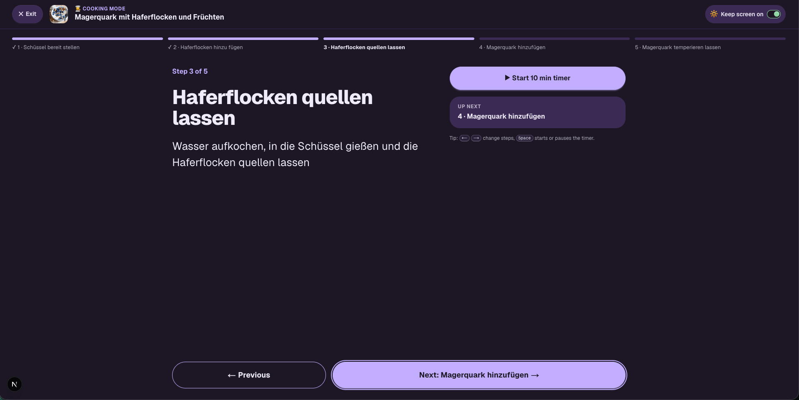
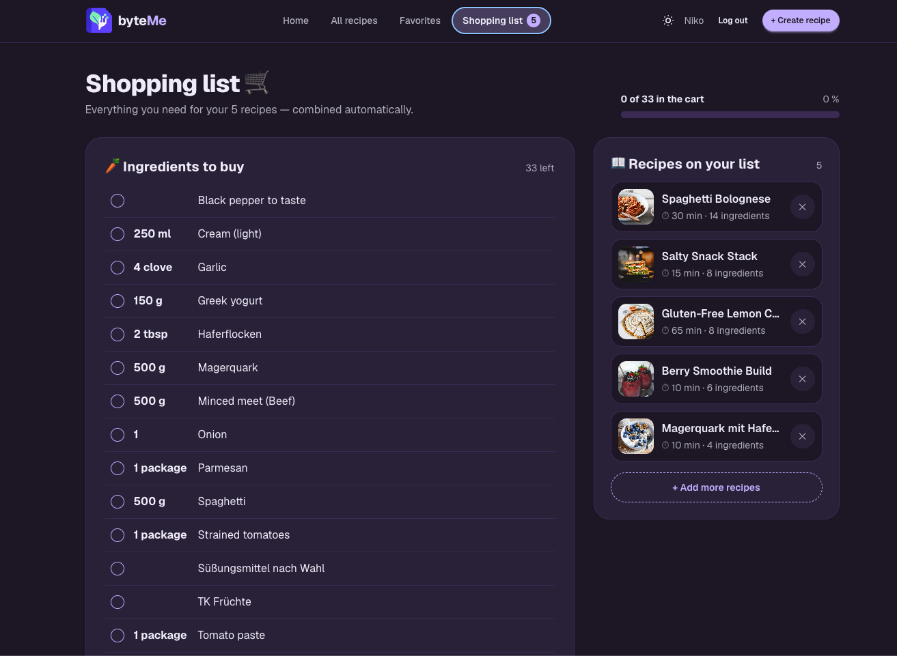
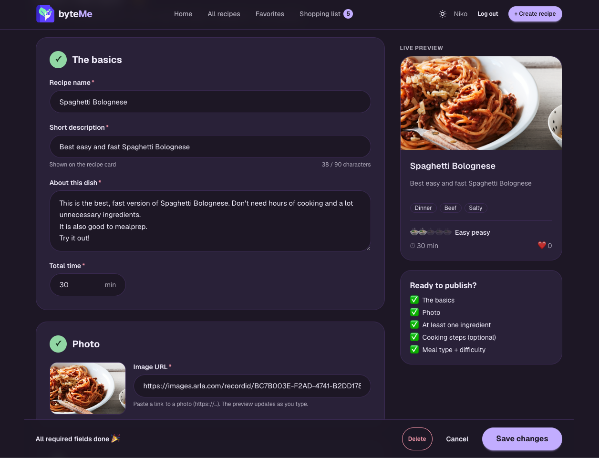

<div align="center">


# byteMe

**Your daily kitchen companion.** Discover recipes, cook step by step with timers, and turn what you're missing into a shopping list.

[**Live demo →**](https://byteme-pb2e.onrender.com)




</div>

> **Try it:** sign in with the demo account **`demo@mail.com`** / **`DemoPasswordByteMe`**, or create your own free account. (The demo account can save favorites, use the shopping list and cooking mode; creating recipes needs approval.)
> The free Render instance sleeps when idle, so the first load can take ~30 seconds.

---

## ✨ Features

**Discover**
- Search with live suggestions, filters for labels, cooking time and difficulty, synced to the URL (shareable, back-button friendly)
- "Recipes of the day" and a 🎲 *Surprise me* button
- Recipes open as a **modal** over the list, or as a full page when shared or reloaded

**Cook**
- **Cooking mode:** one step at a time, a progress bar, multiple timers that keep running in the background, keyboard shortcuts
- The **screen stays awake** while cooking (Screen Wake Lock API), with an on/off toggle

**Plan & shop**
- ♡ Favorites and a 🛒 shopping list that **sums up ingredients** across all saved recipes
- **Tick off what you already have** on a recipe → only the missing ingredients land on the list
- Own custom items, checkable in the store, and a live count badge in the navigation

**Create**
- A guided recipe form with a live card preview, structured ingredients, and steps with timers
- **Drag & drop** to reorder steps (mouse, touch and keyboard)
- **Drafts are auto-saved**: close the tab by accident, restore later

**Accounts**
- Sign-up / sign-in / password reset, with a return to the page you came from after signing in
- Creating recipes requires approval (`user_roles`)

**Everywhere**
- Light & dark theme, fully responsive, undo toasts, styled 404 and error pages

## 📸 Screenshots

| Home | All recipes | Recipe detail |
|---|---|---|
|  |  |  |
| **Cooking mode** | **Shopping list** | **Create recipe** |
|  |  |  |

## 🧠 Technical highlights

A few things that go beyond a basic CRUD app:

- **Shopping list in SQL.** Ingredients from all saved recipes are summed per `(name, unit)`; ingredients the user already has are excluded with a `NOT EXISTS` **anti-join**. Saving runs in one **transaction**, and a composite **foreign key with `ON DELETE CASCADE`** cleans up automatically when a recipe is removed from the list ([`db/migrations/001`](db/migrations/001_shopping_list_have_items.sql)).
- **Secure redirects.** `?next=` return URLs are validated server-side with an allow-rule against **open redirects** ([`lib/auth/safeNext.ts`](lib/auth/safeNext.ts)).
- **Next.js App Router patterns.** Route groups for layouts with and without a header, **parallel + intercepting routes** for the recipe modal, and **server actions** with zod validation plus session/ownership checks.
- **One source of truth for the session.** The server passes the signed-in user down via context, so client caches (favorites, shopping list) update instantly after sign-in or sign-out.
- **Accessibility.** WCAG AA text contrast in both themes, 44px touch targets, keyboard-accessible drag & drop with screen-reader announcements (plus ↑/↓ as the non-drag alternative), `prefers-reduced-motion` respected everywhere.
- **Small touches.** An animated 404 scene in pure CSS (0 KB of images), images with a meal-type fallback, and debounced drafts validated with zod when read back.

## 🛠 Tech stack

| Area | Tools |
|---|---|
| Framework | Next.js 16 (App Router, Server Components, Server Actions), React 19, TypeScript |
| Styling | Tailwind CSS 4, daisyUI 5 (custom light & dark theme) |
| Database | Neon (serverless Postgres), plain SQL via `@neondatabase/serverless` |
| Auth | Neon Auth |
| Validation | zod |
| Drag & drop | dnd-kit |
| Hosting | Render |

## 🚀 Run locally

> Just want to try it? Use the [**live demo**](https://byteme-pb2e.onrender.com). No setup needed.

For development (team members with access to the Neon project):

```bash
git clone https://github.com/MonkeyDNaara/ByteMe.git
cd ByteMe
npm install
cp .env.example .env.local   # fill in the values from the Neon console
npm run dev                  # → http://localhost:3000
```

Database changes live as numbered SQL files in [`db/migrations/`](db/migrations/) and are run once with `psql` (see the comment at the top of each file).

| Script | What it does |
|---|---|
| `npm run dev` | Start the dev server |
| `npm run build` / `npm start` | Production build / serve it |
| `npm run lint` | ESLint |
| `npm run seed` | Insert sample recipes |

## 📁 Project structure

```
app/
├─ (app)/            pages with header & footer (home, all-recipes, favorites, shopping-list, auth, …)
├─ (focus)/          distraction-free cooking mode (no header)
├─ @modal/           intercepting route: recipe detail as a modal over lists
├─ components/       UI components (recipe-details/, recipe-form/, recipe-filters/, status/, toast/, …)
└─ layout.tsx        root layout: fonts, session provider, toasts
lib/                 domain logic, server actions, client hooks (favorites, shopping list, drafts, wake lock)
db/                  numbered SQL migrations
dbQueries.ts         SQL queries
proxy.ts             auth guard for protected routes
docs/                design handoff & screenshots
```

## 👥 Team

Built as a team project at [WBS Coding School](https://www.wbscodingschool.com/) by

- **Kevin**: [@Sazzle-Kevin](https://github.com/Sazzle-Kevin)
- **Eric**: [@EricWlts](https://github.com/EricWlts)
- **Niko**: [@MonkeyDNaara](https://github.com/MonkeyDNaara)
